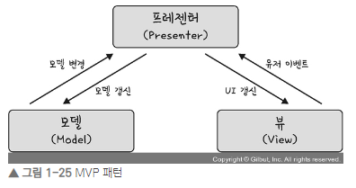
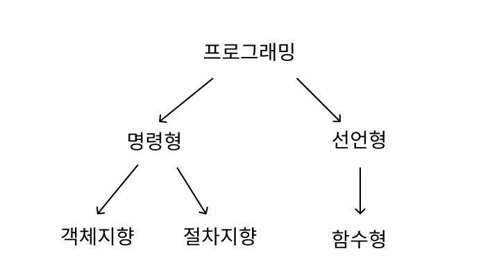

# 👌1.1.8 MVC 패턴
## MVC패턴

: 모델(Model), 뷰(View), 컨트롤러(Controller)로 이뤄진 디자인 패턴이다


### 동작순서
1. 모든 입력(Input)들은 Controller로 전달
2. Controller는 입력에 해당하는 Model을 업데이트
3. 업데이트 결과에 따라 View를 선택(하나의 Controller는 View를 선택할 수 있기 때문에 여러 개의 View를 관리)
4. Controller는 View를 선택할 뿐, 직접 업데이트를 하지 않는다


### 장점

- 개발 프로세스에서 각각의 구성요소에만 집중 개발 가능

- 재사용성과 확장성이 용이


### 단점

- 애플리케이션이 복잡해질수록 모델과 뷰의 관계가 복잡해짐


<br>


### 모델(Model)
: 애플리케이션의 데이터인 데이터베이스, 상수, 변수 등을 뜻한다

뷰에서 데이터를 생성하거나 수정하면 컨트롤러를 통해 모델을 생성하거나 갱신


### 뷰(View)
: inputbox, checkbox, textarea 등 사용자 인터페이스 요소를 나타낸다.

 즉, 모델을 기반으로 사용자가 볼 수 있는 화면

     - 모델이 가진 정보를 따로 저장하지 않아야 하며 화면에 표시하는 정보만 있어야함

     - 변경이 일어나면 컨트롤러에 이를 전달해야함


### 컨트롤러(Controller)
: 하나 이상의 모델과 하나 이상의 뷰를 잇는 다리 역할을 하며 이벤트 등 메인 로직을 담당

또한, 모델과 뷰의 변경 통지를 받으며 이를 해석하여 각각의 구성 요소에 해당 내용에 대해 알린다


### MVC 패턴의 예 리액트
대표 라이브러리는 유저 인터페이스를 구축하기 위한 리액트가 있다.

리액트는 유저 인터페이스 구축을 위한 라이브러리이다.

'가상 DOM'을 통해 실제 DOM을 조작하는 것을 추상화해서 성능을 높였다.


대표적인 특성으로는 불변성(immutable)이 있다

단방향 바인딩이 적용되어 있고, 자유도가 높고, 단방향 바인딩이 적용되어 있고, 자유도가 높고, 메타(페이스북)이 운영 중이며, 넷플릭스,트위터, 우버, MS 등에서 사용


## 👌1.1.9 MVP 패턴

MVC에서 C에 해당하는 컨트롤러가 프레젠터로 교체된 패턴

MVC 패턴으로부터 파생되었다

뷰와 프레젠터는 일대일 관계이기 때문에 MVC패턴보다 더 강한 결합을 지닌 디자인 패턴



Presenter
: View에서 요청한 정보로 Model을 가공하여 View에 전달해 주는 부분


동작순서
1. 모든 입력(Input)들은 View로 전달
2. Presenter는 입력에 해당하는 Model을 업데이트
3. Model 업데이트 결과를 기반으로 View를 업데이트
4. Presenter는 해당 View를 참조(View와 Presenter는 1:1 관계입니다.)
5. Presenter는 View와 Model 인스턴스를 가지고, Model과 View 사이의 매개체 역할을 한다


## 👌1.1.10 MVVM 패턴
MVC의 C에 해당하는 컨트롤러가 뷰모델로 바뀐 패턴

뷰모델은 뷰를 더 추상화한 계층, MVC패턴과는 다르게 커맨드와 데이터 바인딩을 가지는 것이 특징

뷰와 뷰모델 사이의 양방향 데이터 바인딩을 지원, UI를 별도의 코드 수정없이 재사용할 수 있고 단위 테스팅하기 쉽다


### 동작순서
1. 모든 입력(Input)들은 View로 전달
2. ViewModel은 입력에 해당하는 Presentation Logic을 처리하여 View에 데이터를 전달
3. ViewModel은 View를 참조하지 않기 때문에 독립적입니다. 따라서 View는 자신이 이용할 ViewModel을 선택해 바인딩하여 업데이트 받게됨  (Command 패턴이나 Data Binding을 이용하여 V-VM 간 의존성을 없앨 수 있습니다. 그리고 View Model과 View는 1:n 관계이다.)
4. Model이 변경되면 해당하는 ViewModel을 이용하는 View가 자동으로 업데이트된다.
5. ViewModel은 View를 나타내 주기 위한 Model이자, View의 Presentation Logic을 처리한다


### MVVM 패턴의 예 : 뷰
대표 프레임워크로는 뷰(Vue.js)가 있다. Vue.js는 반응형(reactivity)이 특징인 프론트엔드 프레임워크이다.

ex) watch,computed 등으로 쉽게 반응형적인 값들을 구축가능


### 특징
- 함수 사용없이 값 대입만으로 변수가 변경

- 양방향 바인딩,html을 토대로 컴포넌트를 구축할 수 있다는 것이 특징

- 재사용 컴포넌트 기반으로 UI를 구축 가능


#### - 커맨드

: 여러 가지 요소에 대한 처리를 하나의 액션으로 처리할 수 있게 하는 기법


#### - 데이터 바인딩

: 화면에 보이는 데이터와 웹 브라우저의 메모리 데이터를 일치시키는 기법으로, 뷰모델을 변경하면 뷰가 변경 된다


## ✅프로그래밍 패러다임
:  프로그래머에게 프로그래밍의 관점을 갖게 해주는 역할을 하는 개발 방법론


####프로그래밍 패러다임의 분류




### 객체지향 프로그래밍
: 프로그래머들이 프로그램을 상호 작용하는 객체들의 집합으로 볼 수 있게 한다

### 함수형 프로그래밍
: 상태 값을 지니지 않는 함수 값들의 연속으로 생각할 수 있게 해준다


어떤 언어는 특정한 패러다임을 지원,  jdk 1.8 이전의 자바는 객체지향 프로그래밍을 지원하나,
하스켈은 함수형 프로그래밍을 지원

<br>

여러 패러다임을 지원하는 언어 : C++, 파이선, 자바스크립트

JAVA의 경우 jdk 1.8부터 함수형 프로그래밍 패러다임을 지원하기 위해 람다식, 생성자 레퍼런스, 메서드 레퍼런스를 도입

선언형 프로그래밍을 위해 스트림(stream) 같은 표준 API 등도 추가


<br>

## 👌1.2.1 선언형과 함수형 프로그래밍
### ✔ 선언형 프로그래밍(declarative programming)
: 무엇을 풀어내는가에 집중하는 패러다임

프로그램은 함수로 이루어진 것이다.라는 명제가 담긴 패러다임

### ✔ 함수형 프로그래밍(functional programming)
: 선언형 패러다임의 일종


<br>

#### 자연수로 이뤄진 배열에서 최댓값을 찾는 로직

<details>
<summary>코드 토글</summary>
<div markdown="1">

```javascript

const ret = [1, 2, 3, 4, 5, 11, 12]
.reduce((max, num) => num > max ? num : max, 0)
console.log(ret) //12

// num>max 조건문을 통해 true면 num을 false면 max를 반환해주고 0을 초깃값으로 둔다

```
</div>
</details>

reduce()는 '배열'만 받아서 누적한 결괏값을 반환하는 순수 함수


### 함수형 프로그래밍

 -   '순수 함수'들을 블록처럼 쌓아 로직을 구현하고 '고차 함수'를 통해 재사용성을 높인 프로그래밍 패러다임

### 자바스크립트

 -   단순하고 유연한 언어이며, 함수가 일급 객체이기 때문에 객체지향 프로그래밍보단 함수형 프로그래밍 방식 선호


### 순수 함수
출력이 입력에만 의존하는 것


<details>
<summary>코드 토글</summary>
<div markdown="1">

```javascript

const pure = (a, b) => {
return a+b
}

```
</div>
</details>

pure 함수는 매개변수 a,b에만 영향을 받는다.

만약 a,b 말고 다른 전역 변수 c 등이 이 출력에 영향을 주면 순수 함수가 아닙니다.

<br>

### 고차함수
함수가 함수를 값처럼 매개변수로 받아 로직을 생성할 수 있는 것


### ✔ 일급 객체
: 다른 객체들에 일반적으로 적용 가능한 연산을 모두 지원하는 객체

이때 고차 함수를 쓰기 위해서는 해당 언어가 일급 객체라는 특징을 가져야 하며 그 특징은 다음과 같다

- 변수나 메서드에 함수를 할당가능

- 함수 안에 함수를 매개변수로 담을 수 있다

- 함수가 함수를 반환 가능

이외에도 커링, 불변성 등 많은 특징이 있다


<br>


## 👌1.2.2 객체지향 프로그래밍
### 객체지향 프로그래밍(OOP, Object-Oriented Programming)
: 객체들의 집합으로 프로그램의 상호 작용을 표현하며 데이터를 객체로 취급하여 객체 내부에 선언된 메서드를 활용

설계에 많은 시간이 소요, 처리 속도가 다른 프로그래밍 패러다임에 비해 상대적으로 느리다

<details>
<summary>코드 토글</summary>
<div markdown="1">

```javascript

const ret = [1,2,3,4,5,11,12]
class List{
constructor(list){
this.list = list
this.mx = list.reduce((max, num) => num > max ? num : max,0)
}
getMax(){
return this.mx
}
}
const a = new List(ret)
console.log(a.getMax()) //12

```
</div>
</details>

List라는 클래스를 만들고 a라는 객체를 만들 때 최댓값을 추출해내는 메서드를 만든 예제


<br>


## 객체지향 프로그래밍의 특징
: 추상화, 캡슐화, 상속성, 다형성이라는 특징


### - 추상화(abstraction)

복잡한 시스템으로부터 핵심 개념 또는 기능을 간추려내는 것


### - 캡슐화(encapsulation)

객체의 속성과 메서드를 하나로 묶어 일부를 외부에 감춰 은닉하는 것


### - 상속성(inheritance)

상위 클래스의 특성을 하위 클래스가 이어받아 재사용하거나 추가, 확장하는 것

코드의 재사용 측면, 계층적인 관계 생성, 유지 보수성 측면에서 중요


### - 다형성(polymorphism)

하나의 메서드나 클래스가 다양한 방법으로 동작하는 것

ex)오버로딩, 오버라이딩이 대표적이다

<br>

## 오버로딩(overloading)
같은 이름을 가진 메서드를 여러 개 두는 것
매개변수의 유형, 개수 등으로 여러 개를 둘 수 있고 컴파일 중 발생하는 '정적' 다형성

<details>
<summary>코드 토글</summary>
<div markdown="1">

```java

class Person{

	public void eat(String a){
              System.out.println("I eat " + a);
         }
    
    public void eat(String a, String b){
              System.out.println("I eat " + a + " and " + b);
         }
}

public class CalculateArea{

		public static void main(String[] args){
        	Person a = new Person();
            a.eat("apple");
            a.eat("tomato","phodo");
     }
}
/*
I eat apple
I eat tomato and phodo
*/

```
</div>
</details>

위 코드처럼 매개변수의 개수에 따라 다른 함수가 호출되는 것을 알 수 있다
<br>
### 오버라이딩(overriding)
주로 메서드 오버라이딩(method overriding)을 말하며 상위 클래스로부터 상속받은 메서드를 하위 클래스가 재정의하는 것을 의미
런타임 중에 발생하는 '동적' 다형성

<details>
<summary>코드 토글</summary>
<div markdown="1">

```java

class Animal{
public void brak(){
System.out.prinltn("mumu! mumu!");
}
}

class Dog extends Animal{
@Override
public void bark(){
System.out.println("wal!!! wal!!!");
}
}

public class Main{
public static void main(String[] args){
Dog d = new Dog();
d.bark();
}
}

/*
wal!!! wal!!!
*/

```
</div>
</details>
부모 클래스에서 정의해도 자식 클래스에서 재성의하면 자식 클래스 기반으로 메서드가 재정의된다.


## 👌설계 원칙
객체지향 프로그래밍을 설계할 때는 SOLID 원칙을 지켜줘야한다.

S는 단일 책임 원칙, O는 개방-폐쇄 원칙, L은 리스코프 치환 원칙, I는 인터페이스 분리 원칙, D는 의존 역전 원칙 의미


### 단일 책임 원칙 (SRP, Single Responsibility Principle)
: 모든 클래스는 각각 하나의 책임만 가져야 하는 원칙

ex) a라는 로직이 존재하면 어떤 클래스는 a에 관한 클래스여야 하고 이를 수정해도 a와 관련된 수정이어야 한다


### 개방 - 폐쇄 원칙 (OCP, Open Closed Principle)
: 유지 보수 사항이 생기면 코드를 쉽게 확장할 수 있게 하고  수정할 때는 닫혀 있어야 하는 원칙

기존의 코드는 잘 변경하지 않으면서 확장은 쉽게 할 수 있어야 한다


### 리스코프 치환 원칙(LSP, Liskov Substitution Principle)
: 프로그램의 객체는 프로그램의 정확성을 깨뜨리지 않으면서 하위 타입의 인스턴스로 바꿀 수 있어야 하는 것을 의밈

클래스는 상속이 되기 마련이고 부모, 자식이라는 계층 관계가 만들어지는데,  부모 객체에 자식 객체를 넣어도 시스템이 문제없이 돌아가게 만드는 것

즉, 부모 객체와 자식 객체를 바꿔도 문제가 없어야 한다.  


  


### 인터페이스 분리 원칙(ISP, Interface Segregation Principle)
: 하나의 일반적인 인터페이스보다 구체적인 여러 개의 인터페이스를 만들어야 하는 원칙

  


### 의존 역전 원칙(DIP, Dependency Inversion Principle)
: 자신보다 변하기 쉬운 것에 의존하던 것을 추상화된 인터페이스나 상위클래스를 두어 변하기 쉬운 것의 변화에 영향받지 않게 하는 원칙

즉, 상위 계층은 하위 계층의 변화에 대한 구현으로부터 독립해야 한다


## 👌1.2.3 절차형 프로그래밍
로직이 수행되어야 할 연속적인 계산 과정으로 이뤄짐

일이 진행되는 방식으로 그저 코드를 구현하기만 하면 되어 코드의 가독성이 좋으며 실행 속도가 빠르다=> 계산이 많은 작업 등에 쓰임


ex) 포트란(fortran)을 이용한 대기 과학 관련 연산 작업,머신 러닝의 배치 작업

 단점 : 모듈화가 어렵고 유지 보수성이 떨어진다


자연수로 이뤄진 배열에서 최댓값을 찾으라 한다면 다음과 같이 로직을 구상


<details>
<summary>코드 토글</summary>
<div markdown="1">

```javascript

const ret = [1, 2, 3, 4, 5, 11, 12]
let a = 0
for (let i =0;i < ret.length; i++){
a = Math.max(ret[i], a)
}
console.log(a) //12

```
</div>
</details>

ret.length 길이만큼 반복해주고 i를 1씩 증가시키며 ret[i]와 a를 비교하여 큰 값을 a에 대입한다 

## 👌1.2.4 패러다임의 혼합
가장 좋은 패러다임이라는 것은 없다. 비즈니스 로직이나 서비스의 특징을 고려하여 패러다임을 정하는 것이 좋다

하나의 패러다임 기반으로 통일하여 서비스를 구축하는 것도 좋지만 여러 패러다임을 조합해 상황,맥락에 따라 패러다임 간의 장점만 취해 개발하는 것이 좋다.

예를 들어 백엔드에 머신 러닝 파이프라인과 거래 관련 로직이 있다면 머신 러닝 파이프라인은 절차지향형 패러다임, 거래 관련 로직은 함수형 프로그래밍을 적용하는 것이 좋다