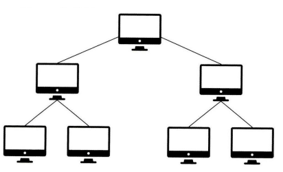

# ✅네트워크
네트워크 : 컴퓨터 등의 장치들이 통신 기술을 이용하여 구축하는 연결망

 

##  ✅2.1 네트워크의 기초

####  네트워크 : 노드(node)와 링크(link)가 서로 연결되어 있거나 연결되어 있지 않은 집합체

#### 노드 : 서버, 라우터, 스위치 등 네트워크 장치

#### 링크 : 유선 또는 무선

## 👌 2.1.1 처리량과 지연 시간
하나를 만들어도 좋은 것을 만드는 게 좋듯이, 네트워크 또한 '좋은' 네트워크를 만드는 것이 중요하다.

### 좋은 네트워크?
- 많은 처리량을 처리               
- 장애 빈도가 적음
- 지연 시간이 짧음                 
- 좋은 보안을 갖춤

### 처리량(throughput)
: 링크를 통해 전달되는 단위 시간당 데이터양

단위로는 bps(bits per second)를 쓴다. 초당 전송 또는 수신되는 비트 수라는 의미

처리량은 사용자들이 많이 접속할 때마다 커지는 트래픽, 네트워크 장치 간의 대역폭, 네트워크 중간 발생하는 에러, 장치의 하드웨어 스펙에 영향을 받는다

 

### - 대역폭
  주어진 시간 동안 네트워크 연결을 통해 흐를 수 있는 최대 비트 수

### 지연시간(latency)
: 요청이 처리되는 시간, 어떤 메시지가 두 장치 사이를 왕복하는 데 걸린 시간

지연시간은 두 장치 사이의 왕복 시간이므로

800ms+ 900ms =1.7s 이다

- 매체 타입(무선,유선), 패킷 크기, 라우터의 패킷 처리 시간에 영향을 받음

## 👌 2.1.2 네트워크 토폴로지와 병목 현상
### 네트워크 토폴로지(network topology)
: 노드와 링크가 어떻게 배치되어 있는지에 대한 방식이자 연결 형태

 

### 토폴로지란?

topology(=망구성방식)  :  컴퓨터 네트워크의 요소들(링크, 노드 등)을 물리적으로 연결해 놓은 것, 또는 그 연결 방식

=> 네트워크의 구조라고도 불림

### 1️⃣트리 토폴로지
: 계층형 토폴로지라고 하며 트리 형태로 배치한 네트워크 구성

장점

- 노드의 추가,삭제가 쉽다

단점

- 특정 노드 트래픽 집중 시, 하위 노드에 영향을 끼침

### 2️⃣버스 토폴로지
: 중앙 통신 회선 하나에 여러 개의 노드가 연결되어 공유하는 네트워크 구성을 말하며 근거리 통신망(LAN)에서 사용

### 장점

- 설치 비용 적다

- 신뢰성 우수

- 중앙 통신 회선에 노드 추가,삭제 쉬움

- 하나의 클라에 문제가 발생해도 전체에는 지장 없음

### 단점

- 스푸핑이 가능

- 전송 데이터가 많으면 병목 현상 발생

- 주 선로에 고장이 나면 전체에 영향

### 💡 스푸핑(spoofing)?
스푸핑(spoofing)이란, 눈속임(spoof)에서 파생된 IT 용어

즉, 속이는것을 이용한 공격 기법들

LAN상에서 송신부의 패킷을 송신과 무관한 다른 호스트에 가지 않도록 하는 <b>스위칭 기능을 마비시키거나 속여 특정 노드에 해당 패킷이 오도록 처리</b>한다. 위 그림처럼 스푸핑 적용 시 패킷이 공격자(악의적인 노드)에게 전달된다

### 3️⃣스타(star,성형) 토폴로지
: 중앙에 있는 노드에 모두 연결된 네트워크 구성

장점

- 노드 추가나 에러탐지가 쉽다

- 패킷의 충돌 발생 가능성이 적다

- 어떤 노드에 장애 발생해도 쉽게 에러 발견

- 중앙 노드 외에 장애가 발생시 다른 노드에 영향이 적다

단점

- 중앙 노드에 장애 발생시 전체 네트워크 사용 불가

- 설치 비용 고가

### 4️⃣링형 토폴로지
: 각각의 노드가 양 옆의 두 노드와 연결하여 전체적으로 고리처럼 하나의 연속된 길을 통해 통신을 하는 망 구성 방식

데이터는 노드에서 노드로 이동되며, 각각의 노드는 고리 모양의 길을 통해 패킷을 처리

#### 장점

- 노드 수가 증가해도 네트워크 상 손실이 적다

- 충돌 발생 가능성 적다

- 노드의 고장 쉽게 발견 가능

- 링형은 토큰링에서 사용

- 토큰을 가진 클라이언트만 통신 가능

- 토큰은 링을 돌며 통신 권한이 있는 client를 찾는다

#### 단점

- 네트워크 구성 변경이 어려움

- 회선에 장애 발생 시 전체 네트워크에 영향

### 5️⃣메시 토폴로지
: 망형 토폴로지라고도 하며, 그물망처럼 연결되어 있는 구조

한 단말 장치에 장애가 발생해도 여러 경로가 존재하여 네트워크를 계속 사용 가능하고 트래픽도 분산 처리가 가능

#### 단점

- 노드의 추가가 어렵다

- 구축 비용과 운용 비용이 고가

 

## 병목현상
: <b>하나의 구성 요소로 인해 전체 시스템의 성능이나 용량이 제한을 받는 현상</b>

ex) 병의 몸통보다 병의 목 부분 내부 지름이 좁아 물이 상대적으로 천천히 쏟아지는 것

네트워크의 토폴로지가 중요한 이유는 이러한 병목 현상을 찾을 때, 중요한 기준이 되기 때문

서비스에서 이벤트 오픈 시 트래픽이 많이 생기고 그 트래픽을 잘못 관리하면 병목현상이 발생해 사용자는 웹 사이트에 들어가지 못한다

### <병목현상이 일어난 네트워크 토폴로지>

위 그림처럼 병목현상이 일어났다고 가정해보자.

이런 상황에서 네트워크가 어떤 토폴로지를 갖는지를 안다면 회선을 적절하게 추가시킴으로써 병목 현상을 무난하게 해결 가능하다.

### <적절한 회선 추가를 통한 병목 현상 해결>

