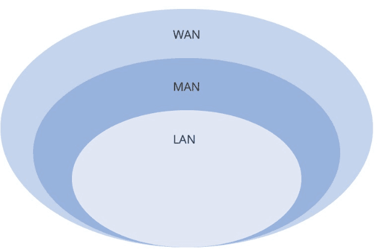

# ✅2.1.3 네트워크 분류
네트워크는 규모를 기반으로 분류할 수 있다

#### LAN(Local Area Network) : 사무실과 개인적으로 소유 가능한 규모

#### MAN(Metropolitan Area Network) : 서울 시 등 시 정도의 규모

#### WAN(Wide Area Network) : 세계 규모

## 1️⃣ LAN(Local Area Network)
: 근거리 통신망을 의미

### ✔ 특징
- 같은 건물이나 캠퍼스 같은 좁은 공간에서 운영

- 전송 속도가 빠르고 혼잡하지 않다

## 2️⃣ MAN(Metropolitan Area Network)
: 대도시 지역 네트워크를 나타낸다

### ✔ 특징
- 도시 같은 넓은 지역에서 운영

- 전송속도는 평균, LAN보다는 더 많이 혼잡

## 3️⃣ WAN(Wide Area Network)
: 광역 네트워크를 의미

### ✔ 특징
- 국가 또는 대륙 같은 더 넓은 지역에서 운영

- 전송 속도는 낮으며 MAN보다 더 혼잡

# ✅2.1.4 네트워크 성능 분석 명령어

애플리케이션 코드상에는 전혀 문제가 없는데 사용자가 서비스로부터 데이터를 가져오지 못하는 상황이 발생하기도 하고,

이는 네트워크 병목 현상일 가능성이 있다

### 네트워크 병목현상의 주된 원인
- 네트워크 대역폭
- 네트워크 토폴로지
- 서버 CPU, 메모리 사용량
- 비효율적인 네트워크 구성
위와 같은 문제 발생 시, 네트워크 관련 테스트와 네트워크와 무관한 테스트를 통해

<b>'네트워크로부터 발생한 문제점'인 것을 확인 후 네트워크 성능을 분석</b>해봐야 한다.

## 1️⃣ ping(Packet INternet Groper)
: 네트워크 상태를 확인하려는 대상 노드를 향해 일정 크기의 패킷을 전송하는 명령어

### 핑으로 확인 가능한 것들
- 해당 노드의 패킷 수신 상태
- 도달하기까지 걸린 시간 등
- 해당 노드까지 네트워크가 잘 연결되어 있는지 확인

TCP/IP 프로토콜 중에 <b>ICMP 프로토콜을 통해 동작</b>하며,
ICMP 프로토콜을 지원하지 않는 기기 대상으로는 실행할 수 없거나
<b>네트워크 정책상 ICMP나 traceroute를 차단하는 대상은 ping 테스팅이 불가능</b>하다

ping [IP 주소 또는 도메인 주소] 로 실행한다.

ex) redis를 다운하게되면 ping pong을 통해 확인이 가능하다.

 

## 2️⃣ netstat
: 접속되어 있는 서비스들의 네트워크 상태를 표시해주는 명령어

네트워크 접속, 라우팅 테이블, 네트워크 프로토콜 등 리스트를 보여준다.

서비스의 포트가 열려 있는지 확인할 때 사용

현재 접속하고 있는 사이트 등에 관한 네트워크 상태 리스트를 볼 수 있는 것을 알 수 있다.

 

## 3️⃣ nslookup
: DNS에 관련된 내용을 확인하기 위해 쓰는 명령어

특정 도메인에 매핑된 IP를 확인하기 위해 사용

 

## 4️⃣ tracert
: 목적지 노드까지 네트워크 경로를 확인할 때 사용하는 명령어

<b>윈도우에서는 tracert, 리눅스에서는 traceroute라는 명령어로 구동</b>

목적지 노드까지 구간들 중 어느 구간에서 응답이 느려지는지 등을 확인 가능하다.

위에 언급한 4개 외에도 ftp를 통한 대형 대형 파일전송 테스트나 tcpdump를 통한 노드를 통한 패킷 캡쳐 등의 명령어가 있다. 네트워크 분석 프로그램으로는 wireshark, netmon이 있다

## ✅2.1.5 네트워크 프로토콜 표준화

### 네트워크 프로토콜?
: <b>다른 장치들끼리 데이터를 주고받기 위해 설정된 공통된 인터페이스</b>

### 프로토콜은 <u>IEEE 또는 IETF라는 표준화 단체가 결정</u>한다

IEEE802.3은 유선 LAN 프로토콜
예를 들어 웹을 접속할 때 쓰는 HTTP,

'서로 약속된' 인터페이스인 HTTP라는 프로토콜을 통해 노드들은 웹서비스를 기반으로 데이터를 주고 받는다