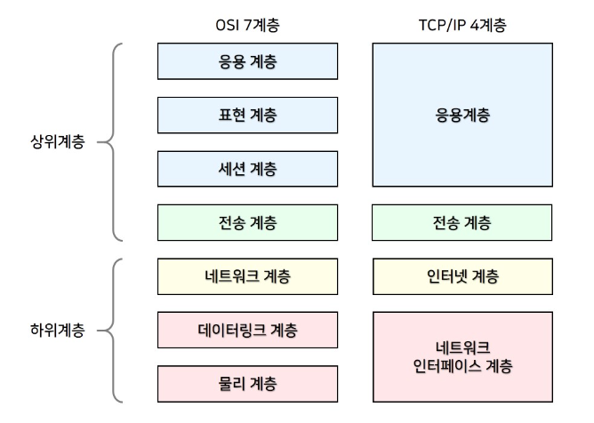
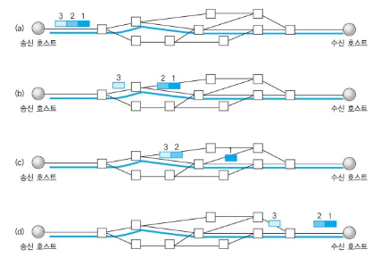
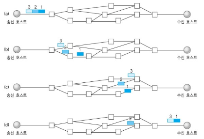
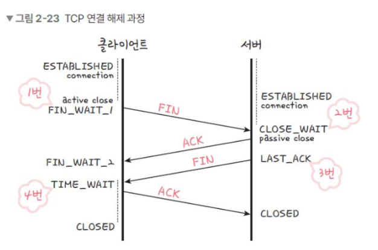
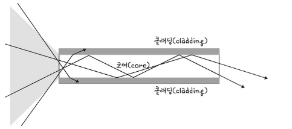
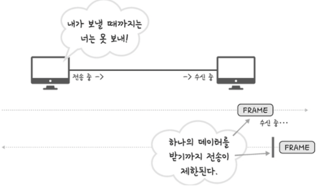
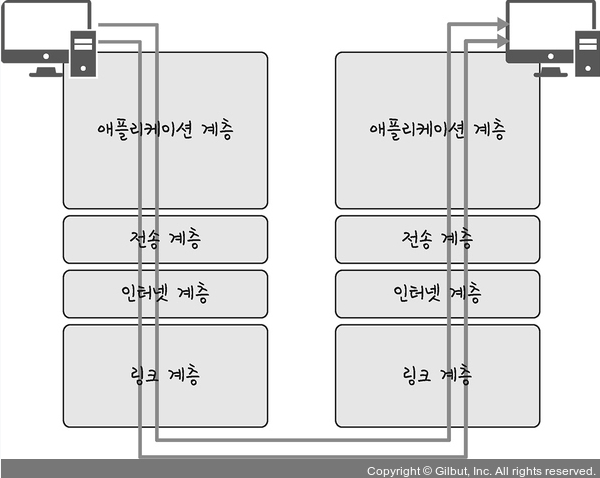
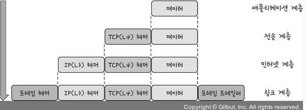
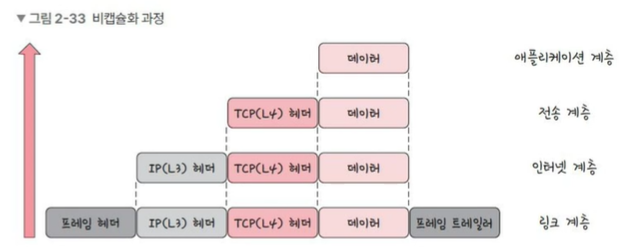

# ✅2.2 TCP/IP 4계층 모델
<b>인터넷 프로토콜 스위트(internet protocol suite)</b>는 인터넷에서 컴퓨터끼리 서로 정보를 주고받는 데 쓰이는 프로토콜

<b>TCP/IP 4계층 모델로 설명하거나 OSI 7계층 모델로 설명</b>

<b>TCP/IP(Transmission Control Protocol/Internet Protocol) 4계층 모델을 중심으로 설명</b>

-프로토콜은 컴퓨터 내부에서, 또는 컴퓨터 사이에서 데이터의 교환 방식을 정의하는 규칙 체계 
-TCP (전송 제어 프로토콜)은 두 개의 호스트를 연결하고 데이터 스트림을 교환하게 해주는 중요한 네트워크 프로토콜

## ✅2.2.1 계층 구조

- OSI 계층

: 애플리케이션 계층을 3개로 쪼개 링크 계층을 데이터 링크 계층,물리 계층 
인터넷 계층을 네트워크 계층으로 부른다

위 계층들은 특정 계층이 변경되었을 때 다른 계층이 영향 받지 않도록 설계되었다.

### 1️⃣애플리케이션 계층
: FTP, HTTP, SSH, SMTP, DNS 등 응용 프로그램이 사용되는 프로토콜 계층

웹 서비스, 이메일 등 서비스를 실질적으로 사람들에게 제공하는 층

전부 알아야 하는 부분 이기에 접는 글을 쓰지 않았다

- **FTP**

: 장치와 장치 간의 파일을 전송하는데 사용되는 표준 통신 프로토콜

- **SSH**

: 보안되지 않은 네트워크에서 네트워크 서비스를 안전하게 운영하기 위한 암호화 네트워크 프로토콜

- **HTTP**

: World Wide Web을 위한 데이터 통신의 기초이자 웹 사이트를 이용하는 데 쓰는 프로토콜

- **SMTP**

: 전자 메일 전송을 위한 인터넷 표준 통신 프로토콜

- **DNS**

도메인 이름과 IP 주소를 매핑해주는 서버

ex) www.naver.com에 DNS 쿼리가 오면 [Root DNS] -> [.com DNS] -> [.naver DNS] -> [.www DNS]

### 2️⃣전송 계층
: 송신자와 수신자를 연결하는 통신 서비스를 제공하며 연결 지향 프데이터 스트림 지원, 신뢰성, 흐름 제어를 제공

애플리케이션과 인터넷 계층 사이의 데이터가 전달될 때의 중계 역할

ex) 대표적으로 TCP,UDP가 있다

**TCP** : 패킷 사이의 순서를 보장하고 연결지향 프로토콜을 사용해서 연결해 신뢰성을 구축해 수신 여부를 확인 
          '가상회선 패킷 교환 방식'을 사용

**UDP** : 순서를 보장하지 않고 수신 여부를 확인하지 않으며 단순 데이터만 주는 '데이터그램 패킷 교환 방식'을 사용

### ✔ 가상회선 패킷 교환 방식
: 각 패킷에는 가상회선 식별자가 포함되며 모든 패킷을 전송하는 가상회선이 해제

패킷들은 전송된 '순서대로' 도착하는 방식

위 사진과 같이 패킷이 순서대로 도착

### ✔ 데이터그램 패킷 교환 방식
: 패킷이 독립적으로 이동하며 최적의 경로를 선택하여 간다

하나의 메시지에서 분할된 여러 패킷은 서로 다른 경로로 전송될 수 있으며, 도착한 '순서가 다를 수' 있는 방식

어떤 회선을 중심으로 가는 것이 아니라 따로 이동하며 순서도 다르게 도착

### ✔ TCP 연결 성립 과정
TCP는 신뢰성을 확보할 때 '3-웨이 핸드셰이크(3-way handshake)'라는 작업을 진행

클라이언트와 서버가 통신할 때 다음과 같은 세 단계의 과정

**1. SYN 단계**

   :  클라이언트는 서버에 클라이언트의 ISN을 담아 SYN을 보낸다.

   ISN은 새로운 TCP 연결의 첫 번째 패킷에 할당된 임의의 시퀀스 번호를 말하며 이는 장치마다 다르다.

   (예시에서는 12010)

**2. SYN + ACK 단계**

   :  서버는 클라이언트의 SYN을 수신하고 서버의 ISN을 보내며 승인번호로 클라이언트의 ISN +1을 보낸다

**3. ACK 단계**

   :  클라이언트는 서버의 ISN +1한 값인 승인번호를 담아 ACK를 서버에 보낸다

3-웨이 핸드셰이크 과정 후 신뢰성이 구축되고 데이터 전송을 시작.

참고로 TCP는 이 과정이 있기에 신뢰성 있는 계층이라 하며 UDP는 이 과정이 없기에 신뢰성 없는 계층이라 한다.

**-SYN**

SYNchronization 의 약자 연결 요청 플래그

**-ACK**

ACKnowledagement 의 약자 응답 플래그

**-ISN**
Initial Sequence Numbers의 약어, 초기 네트워크 연결을 할 때 할당된 32 비트 고유 시퀀스 번호

### ✔ TCP 연결 해제 과정
TCP가 연결을 해제할 때는 4-웨이 핸드셰이크(4-way handshake) 과정이 발생

1. 클라이언트가 연결을 닫으려고 하면 FIN으로 설정된 세그먼트를 보낸다.

   클라이언트는 FIN_WAIT_1 상태로 돌아가 서버의 응답을 기다린다

2. 서버는 클라이언트로 ACK라는 승인 세그먼트를 보낸다. 그리고 CLOSE_WAIT 상태에 들어간다.

   클라이언트가 세그먼트를 받으면 FIN_WAIT_2 상태에 들어간다

3. 서버는 ACK를 보내고 일정 시간 이후에 클라이언트에 FIN이라는 세그먼트를 보낸다

4. 클라이언트는 TIME_WAIT 상태가 되고 다시 서버로 ACK를 보내 서버는 CLOSED 상태가 된다.

   이후 클라이언트는 어느 정도의 시간을대기한 후 연결이 닫히고 클라이언트와 서버의 모든 자원 연결이 해제

### ❗눈여겨봐야할 TIME_WAIT

**일정 시간 뒤에 연결을 닫는 이유**

1. 지연 패킷이 발생할 경우를 대비하기 위함

   => 패킷이 늦게 도달해 이를 처리하지 못한다면 데이터 무결성 문제가 발생

2. 두 장치가 연결이 닫혔는지 확인하기 위함

   => LAST_ACK 상태에서 닫히게 되면 다시 새로운 연결을 하려고 할 때 장치는 LAST_ACK로 되어 있기에 접속 오류가           발생한다

### TIME_WAIT

소켓이 바로 소멸되지 않고 일정 시간 유지되는 상태,지연 패킷 등의 문제점 해결에 쓰임

CentOS6,우분투는 60초이며 윈도우는 4분이다. OS마다 조금씩 다르다

### 데이터 무결성(data integrity)

데이터의 정확성과 일관성을 유지하고 보증하는 것

## 3️⃣인터넷 계층
: 장치로부터 받은 네트워크 패킷을 IP 주소로 지정된 목적지로 전송하기 위해 사용되는 계층

IP, ARP, ICMP 등이 있고 패킷을 수신할 상대 주소를 지정해 데이터를 전달한다.

상대방이 제대로 받았는지에 대해 보장하지 않는 비연결형적인 특징

## 4️⃣링크 계층

: 전선, 광섬유, 무선 등으로 실질적으로 데이터를 전달하며 장치 간에 신호를 주고받는 '규칙'을 정하는 계층

(= '네트워크 접근 계층' 이라고도 부름)

**물리 계층** :무선 LAN과 유선 LAN을 통해 0과 1로 이루어진 데이터를 보내는 계층

**데이터 링크 계층** : '이더넷 프레임'을 통해 에러 확인, 흐름 제어, 접근 제어 담당하는 계층

### ✔ 유선 LAN(IEEE802.3)
IEEE802.3 : 유선 LAN을 이루는 이더넷
            , 전이중화 통신을 쓴다

### - 전이중화 통신
  : 양쪽 장치가 동시에 송수신할 수 있는 방식

1. 송신로와 수신로로 나눠서 데이터를 주고받음

2. 현대의 고속 이더넷은 이 방식을 기반으로 통신

### CSMA/CD
  : 데이터를 '보낸 이 후' 충돌이 발생한다면 일정 시간 이후 재전송하는 방식(송수신로가 합쳐서 1개)

1. CSMA/CD방식은 이전에 유선 LAN에 사용된 '반이중화 통신' 중 하나

2. 송수신로가 각각 있지 않고 한 경로를 통해 데이터를 주고 받기에, 데이터를 보낼 때 충돌에 대비해야한다

### ✔ 유선 LAN을 이루는 케이블
TP 케이블(트위스트 페어 케이블)과 광섬유 케이블이 대표적

- 트위스트 페어 케이블(twisted pair cable)
  : 하나의 케이블처럼 보이지만 실제로는 여덟 개의 구리선을 두 개씩 꼬아서 묶은 케이블 지칭

- 여러 개의 구리선으로 이루어져 있다.

- 구리선을 실드 처리하지 않고 덮은 UTP 케이블과 실드 처리하고, 덮은 STP로 나눠진다

- 주변에서 많이 보이는 케이블은 UTP 케이블로 흔히 LAN 케이블이라고 한다.

RJ-커넥터는 LAN 케이블을 꽂을 수 있는 커넥터이다.

- 광섬유 케이블(optical cable)
  : 광섬유로 만든 케이블

레이저를 이용해 통신하기 때문에 구리선과는 비교할 수 없을 만큼의 장거리 및 고속 통신이 가능

1. 보통 100Gbps의 데이터를 전송

2. 광섬유 내부와 외부가 다른 밀도를 가져 유리나 플라스틱 섬유로 제작해 빛이 내부에서 계속 반사하며 전진해 반대편까지 끝까지 가는 원리

**코어**     :  빛의 굴절률이 높은 부분

**클래딩** :  빛의 굴절률이 낮은 부분

### ✔ 무선 LAN
무선 LAN(IEEE802.11)

: 수신과 송신에 같은 채널을 사용하기 때문에 반이중화 통신을 사용

### 반이중화 통신

: 양쪽 장치는 서로 통신할 수 있지만, 동시에는 통신할 수 없으며, 한 번에 한 방향만 통신할 수 있는 방식

일반적으로 장치가 신호를 수신하기 시작하면 응답하기 전에 전송이 완료될 때까지 기다려야한다.

둘 이상의 장치가 동시 전송 시에 충돌 발생으로 메시지가 손실이나 왜곡될 수 있기에 충돌 방지 시스템이 필요하다

### - CSMA/CA
  : 반이중화 통신 중 하나로 장치에서 데이터를 보내기 전에 사전에 가능한 한 충돌을 방지하는 방식

1. 데이터를 송신하기 전에 무선 매체를 살핌

2. 캐리어 감지 : 회선이 비어있는지를 판단

3. IFS(Inter FrameSpace): 랜덤 값을 기반으로 정해진 시간만큼 기다림,만약 무선 매체가 사용 중이면 점차 간격을 늘려 기다림

4. 이후 데이터를 송신함

이와 반대되는 전이중화 통신은 양방향 통신이 가능해 충돌 감지나 충돌 방지가 불필요하다

## ✔ 무선 LAN을 이루는 케이블
WLAN(Wireless Local Area Network) : 무선 신호 전달 방식을 이용해 2대 이상의 장치를 연결하는 기술

비유도 매체인 공기에 주파수를 쏘아 무선 통신망을 구축

#### 주파수 대역 - 2.4GHz 또는 5GHz를 보통 사용

2.4GHz  - 장애물에 강한 특성을 가지고 있지만 전자레인지,무선 등 전파 간섭이 많이 발생

5GHz     - 사용할 수 있는 채널 수도 많고 동시 사용 가능 
         - 상대적으로 깨끗한 전파 환경을 구축 가능

### 와이파이
: 전자기기들이 무선 LAN 신호에 연결 가능하게 하는 기술  사용하기 위해서는 무선 접속 장치(AP,Access Point)가 필요

흔히 AP를 공유기 라고 부르며, 이를 통해 유선 LAN 신호를 무선 LAN 신호로 바꿔주어 신호가 닿는 범위 내에서 무선 인터넷을 사용할 수 있게 한다.추가적으로 무선 LAN 이용 기술에는 지그비,블루투스 등이 있다

### BSS(Basic Service Set)
: 기본 서비스 집합

1. 단순 공유기를 통해 네트워크에 접속하는 것이 아닌 동일 BSS 내에 있는 AP들과 장치들이 성로 통신 가능한 구조

2. 근거리 무선 통신을 제공

3. 하나의 AP만을 기반으로 구축해 사용자가 한 곳에서 다른 곳으로 자유롭게 이동하며 네트워크에 접속은 불가능

### ESS(Extended Service Set)
: 하나 이상의 연결된 BSS 그룹

1. 장거리 무선 통신 제공

2. BSS보다 더 많은 가용성과 이동성을 지원

3. 사용자는 한 장소에서 다른 장소로 이동하며 중단 없이 네트워크에 계속 연결 가능

### ✔ 이더넷 프레임
: 데이터 링크 계층은 이더넷 프레임을 통해 전달받은 데이터의 에러를 검출하고 캡슐화하며 다음같은 구조를 가진다

Preamble : 이더넷 프레임 시작을 알림

SFD(Start Frame Delimiter) : 다음 바이트부터 MAC 주소 필드 시작됨을 알림

DMAC, SMAC : 수신,송신 MAC주소를 말함

EtherType : 데이터 계층 위의 계층인 IP 프로토콜을 정의한다. IPv4, IPv6가 된다

Payload : 전달받은 데이터

CRC : 에러 확인 비트

### -  MAC 주소
컴퓨터나 노트북 등 각 장치에는 네트워크 연결을 위한 장치(LAN 카드)가 있는데, 이를 구별하기 위한 식별번호를 말한다. 6바이트(48비트)로 구성

✔ 계층 간 데이터 송수신 과정

애플리케이션 계층에서 전송계층

: 필자가 보내는 요청 값들이 캡슐화 과정을 거쳐 전달

- 링크 계층을 통해 해당 서버와 통신,

- 해당 서버의 링크 계층으로부터 애플리케이션까지 비캡슐화 과정을 거쳐 데이터 전송

### ✔ 캡슐화 과정
: 상위 계층의 헤더와 데이터를 하위 계층의 데이터 부분에 포함시키고 해당 계층의 헤더를 삽입하는 과정

1. 애플리케이션의 데이터가 전송계층으로(세그먼트, 데이터그램화됨) 가면서 TCP(L4)헤더가 붙는다

2. 인터넷 계층으로 가며 IP(L3)헤더가 붙여지며 패킷화가 된다

3. 링크 계층으로 가며 프레임 헤더와 프레임 트레일러가 붙어 '프레임'화가 된다

### ✔ 비캡슐화 과정
: 하위 계층에서 상위 계층으로 가며 각 계층의 헤더 부분을 제거하는 과정

(사진 색깔이 달라도 이해해주세요..아래만 컬러를 구했습니다) 그냥봐

캡슐화된 데이터를 받게 되면 링크 계층에서부터 타고 올라오며

프레임화 -> 패킷화 -> 세그먼트,데이터그램화-> 메시지화

위와 같은 비캡슐화 과정이 발생

최종적으로 사용자에게 애플리케이션의 PDU인 메시지로 전달

✅2.2.2 PDU
✔ PDU?
: 네트워크의 어떠한 계층에서 계층으로 데이터가 전달될 때 한 덩어리의 단위

PDU는 제어 관련 정보들이 포함된 '헤더', 데이터를 의미하는 '페이로드'로 구성되며 계층마다 부르는 명칭이 다르다.

애플리케이션 계층 : 메시지
전송 계층 : 세그먼트(TCP), 데이터그램(UDP)
인터넷 계층 : 패킷
링크 계층 : 프레임(데이터 링크 계층), 비트(물리 계층)

송수신에 있어서는 모든 PDU 중 비트를 이용하는 것이 가장 빠르고 효율이 높지만, 애플리케이션 계층에서는 문자열을 기반으로 송수신하는데, 이유는 헤더에 authorization 값 등 다른 값들을 넣는 확장이 쉽기 때문이다.