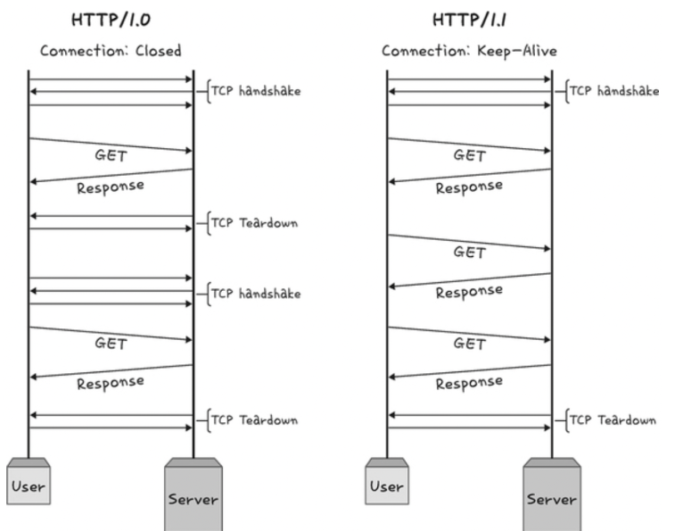
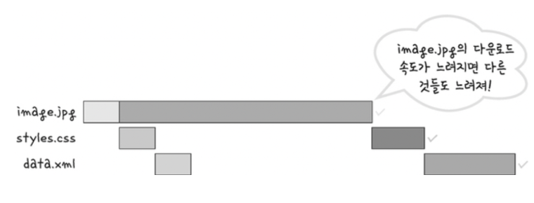
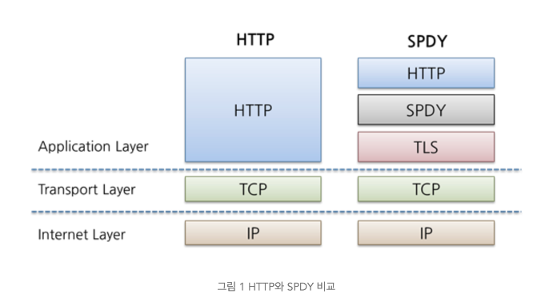
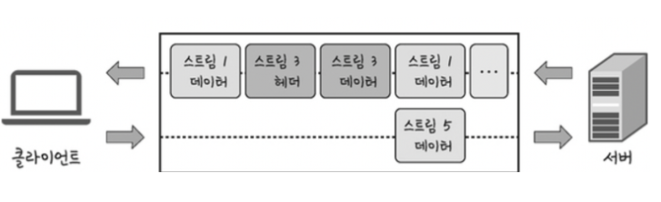
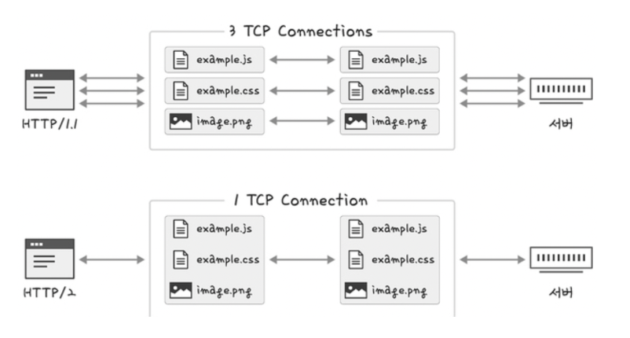
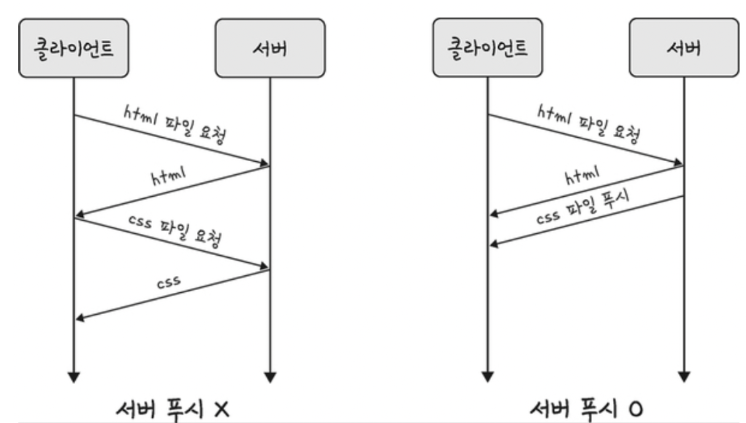

## ✅2.5 HTTP
기본적으로 HTTP는 전송 계층 위에 있는 애플리케이션 계층으로서 웹 서비스 통신에 사용된다

## ✅2.5.1 HTTP/1.0
기본적으로 한 연결당 하나의 요청을 처리하도록 설계되었습니다. 이는 서버로부터 파일을 가져올 때 마다 TCP의 3-웨이 핸드셰이크를 계속해서 열어야 하기에 RTT가 증가하는 단점이 있었다.


### -RTT가 무엇일까?
: 패킷이 목적지에 도달하고 나서 다시 출발지로 돌아오기까지 걸리는 시간. 즉 패킷 왕복 시간을 말한다.

<br>

### RTT의 증가를 해결하기 위한 방법
RTT (Round Trip Time, 왕복 시간) :

매번 연결할 때마다 RTT가 증가하니 서버에 부담이 많이 가고 사용자 응답 시간이 길어져, 이를 해결하기 위해 이미지 스플리팅, 코드 압축, 이미지 Base64 인코딩을 사용

### 여기서 스플리팅이란?

이미지가 합쳐져 있는 하나의 이미지를 다운받고, 이를 기반으로 background-image의 포지션을 이용해 이미지를 표기하는 방법

<details>
<summary>코드 예시</summary>
<div markdown="1">

```javascript

#icons>li>a{
background-image: url('icons.png');
width:25px;
display:inline-block;
height:25px;
repeat:no-repeat;
}
#icons>li:nth-child(1)>a{
background-position: 2px -8px;
}
#icons>li:nth-child(2)>a{
background-position: -29px -8px;
}

```

</div>
</details>

<br>

### 코드 압축

코드를 압축해서 개행 문자, 빈칸을 없애서 코드의 크기를 최소화하는 방법

<details>
<summary>코드 예시 및 설명</summary>
<div markdown="1">

```javascript

const express = require('express')
const app = express()
const port = 3000

app.get('/', (req,res) => {
  	res.send('Hello World!')
})

app.listen(port, () => {
	console.log('Example app listening on port ${port}')
})

```

위의 코드를 아래와 같이 바꾸는 방법을 말한다

```javascript

const express=require('express'),app=express(),port=3e3;app.
get('/',(e,p)=>{p.send('Hello World!')}),app.listen(3e3,()=>{console.
log('Example app listening on port 3000')});

```


</div>
</details>


## 이미지 Base64 인코딩
#### 이미지 파일을 64진법으로 이뤄진 문자열로 인코딩하는 방법
이 방법을 사용시에는 서버와의 연결을 열고 이미지에 대해 http 요청을 할 필요가 없는 장점이 있으나, 크기가 약 37%정도 더 커지는 단점이 있다. 최근 S3나 azure 같은 이미지 호스팅 서비스를 이용해 큰 코스트 소비 없이 이미지를 불러올 수 있기에 위 방법을 사용하지 않는다.


## 인코딩이란?
정보의 형태나 형식을 표준화,보안,처리 속도 향상, 저장 공간 절약 등을 위해 다른 형태나 형식으로 변환하는 처리방식을 말한다


# ✅2.5.2 HTTP/1.1
HTTP/1.0에서 발전한 것이 HTTP/1.1이다.

사용할 때 마다 TCP를 연결하는 것이 아닌 한 번 TCP 초기화를 한 후 keep-alive하는 옵션으로 여러 개의 파일을 송수신할 수 있게 바뀌었다. 아래 그림처럼 TCP 3-WAY HANDSHAKE가 발생하면 다음부터는 발생하지 않는 것을 볼 수 있다.

하지만 문서 안에 포함된 다수의 리소스를 처리하려면 요청할 리소스 개수에 비례해 대기 시간이 길어지는 단점이 있다.



<br>

### HOL Blocking
네트워크에서 같은 큐에 있는 패킷이 그 첫 번째 패킷에 의해 지연될 때 발생하는 성능 저하 현상



<br>

### 무거운 헤더 구조
쿠키 등 많은 메타데이터가 압축되지 않은 채 들어 있어 무겁다

# ✅2.5.3 HTTP/2
SPDY 프로토콜에서 파생된 HTTP/1.x보다 지연 시간을 줄이고 응답 시간을 더 빠르게 할 수 있고 멀티플렉싱, 헤더 압축, 서버 푸시, 요청의 우선순위 처리를 지원하는 프로토콜이다.

## -SPDY 프로토콜
SPDY(스피디/speedy로 발음)는 웹 컨텐츠를 전송할 목적으로 구글이 개발한 비표준 개방형 네트워크 프로토콜이다.

초창기 인터넷 환경에서 고안된 HTTP의 단점들을 보완해, 현재 그리고 앞으로의 인터넷 환경을 보다 효율적으로 이용할 수 있는 프로토콜로 제안된 것이다.

### SPDY 특징
- 항상 TLS위에서 동작
- HTTP 헤더 압축
- 바이너리 프로토콜
- Multiplexing
- Server Push


<br>

## 멀티플렉싱이란?
이름에서 알 수 있듯이 여러 개의 스트림을 사용해 송수신한다는 것이다.
이를 통해 특정 스트림의 패킷이 손실되었다 해도 해당 스트림에만 영향을 미치고 나머지 스트림은 멀쩡하게 동작가능

### -스트림
시간이 지남에 따라 사용할 수 있게 되는 일련의 데이터 요소를 가리키는 데이터 흐름


위 그림은 하나의 연결 내 여러 스트림을 캡처한 모습으로, 병렬적인 스트림을 통해 데이터를 서빙한다.
애플리케이션에서 받은 메시지를 독립된 프레임으로 조각내 서로 송수신 후 다시 조립해 데이터를 주고받는다

단일 연결을 사용해 병렬로 여러 요청을 받고 응답을 줄 수 있고, 이와 같이 진행시 HOL Blocking을 해결가능하다.


### 헤더 압축
허프만 코딩 압축 알고리즘을 사용하는 HPACK 압축 형식으로 헤더 압축 문제를 해결했다


### 허프만 코딩
문자열을 문자 단위로 쪼개 빈도수를 세어 빈도가 높은 정보는 적은 비트 수를 사용해 표현한다.
빈도가 낮은 정보는 비트 수를 많이 사용해 표현해 전체 데이터의 표현에 필요한 비트양을 줄이는 원리이다.


### 서버 푸시
HTTP/1.1에서는 클라이언트가 서버에 요청을 해야 파일을 다운 받을 수 있었다면,
HTTP/2는 클라이언트 요청 없이 서버가 바로 리소스를 푸시할 수 있다.
사전에 리소스 요청을 예측하여, 서버에서 푸쉬를 해줌으로써 성능을 개선했다.

