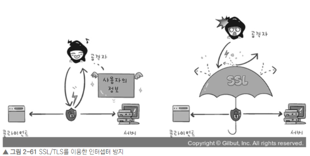
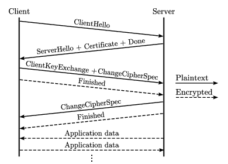
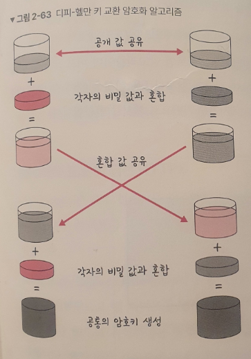
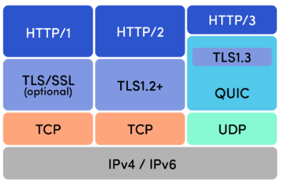

# ✅2.5.4 HTTPS
HTTP/2는 HTTPS 위에서 동작

HTTPS는 애플리케이션 계층과 전송 계층 사이에 신뢰 계층인 SSL/TLS 계층을 넣은 신뢰할 수 있는 HTTP 요청을 말하며 '통신을 암호화'라고 한다.


# 1️⃣SSL/TLS
SSL(Secure Socket Layer)은 SSL 1.0부터 시작해 SSL 2.0, SSL 3.0, TLS(Transport Layer Security Protocal)1.0, TLS 1.3까지 버전이 올라가며 마지막으로 TLS로 명칭이 변경됐으나, 일반적으로 SSL/TLS로 많이 부른다.

(해당 책에서는 TLS 1.3을 기반으로 설명함)


<b>SSL/TLS은 전송 계층에서 보안을 제공하는 프로토콜</b>이다.

클라이언트와 서버가 통신할 때 SSL/TLS를 통해 <b>제3자가 메시지를 도청하거나 변조하지 못하도록 한다.</b>

위와 같이 SSL/TLS를 통해 공격자가 서버인 척하며 사용자 정보를 가로채는 네트워크상의 '인터셉터'를 방지할 수 있다.
SSL/TLS는 보안 세션을 기반으로 데이터를 암호화하며 보안 세션이 만들어질 때 인증 메커니즘, 키 교환 알고리즘, 해싱 알고리즘이 사용된다.

### ✔보안 세션
<b>: 보안이 시작되고 끝나는 동안 유지되는 세션</b>
SSL/TLS는 핸드셰이ㅡ를 통해 보안 세션을 생성하고 이를 기반으로 상태 정보 등을 공유한다.

### --세션
운영체제가 어떤 사용자로부터 자신의 자산 이용을 허락하는 일정 기간
즉, 사용자는 일정 시간동안 응용 프로그램,자원 등을 사용한다


TLS의 핸드셰이크

클라이언트와 서버와 키를 공유하고 이를 기반으로 인증, 인증 확인 등의 작업이 일어나는 단 한 번의 1-RTT가 생긴 후 데이터를 송수신한다.

클라이언트에서 사이퍼 슈트(cypher suites)를 서버에 전달한다.
서버는 받은 사이퍼 슈트의 암호화 알고리즘 리스트가 제공 가능한지 확인한다.
제공 가능하면 서버에서 클라이언트로 인증서를 보내는 인증 메커니즘이 시작되고 이후 해싱 알고리즘 등으로 암호화된 데이터의 송수신이 시작된다.


### ❕ 사이퍼 슈트란?
: 프로토콜, AEAD 사이퍼 모드, 해싱 알고리즘이 나열된 규약


총 5개가 있다

- TLS_AES_128_GCM_SHA256

- TLS_AES_256_GCM_SHA384

- TLS_CHACHA20_POLY1305_SHA256

- TLS_AES_128_CCM_SHA256

- TLS_AES_128_CCM_8_SHA256


예로 TLS_AES_128_GCM_SHA256에는 세 가지 규약이 있는데 TLS 프로토콜, AES_128_GCM은 AEAD 사이퍼 모드, SHA256은 해싱 알고리즘을 뜻한다

## ✔인증 메커니즘
: CA(Certificate Authorities)에서 발급한 인증서를 기반으로 이뤄진다

<b>CA에서 발급한 인증서</b>는 안전한 연결을 시작하는데 있어 필요한 <b>'공개키'를 클라이언트에 제공</b>하고, <b>사용자가 접속한 '서버가 신뢰'할 수 있는 서버임을 보장</b>한다. 인증서는 서비스 정보, 공개키, 지문, 디지털 서명 등으로 이뤄져 있다.

***CA는 신뢰성이 엄격한 공인 기업들만 참여 가능***하며, 대표 기업으로는 Comodo, GoDaddy, GlobalSign, 아마존 등이 있다.

### CA 발급 과정
자신의 서비스에 CA 인증서를 발급받으려면 자신의 사이트 정보와 공개키를 CA에 제출해야한다.
이후 CA는 공개키를 해시한 값인 지문(finger print)을 사용하는 CA 비밀키 등을 기반으로 CA 인증서를 발급한다

<div markdown="1">

```javascript
-개인키
비밀키라고 하며, 개인이 소유하고 있는 키이자 반드시 자신만이 소유해야하는 키

-공개키
공개되어 있는 키
```
</div>


### ✔암호화 알고리즘
## 키 교환 암호화 알고리즘

- 대수곡선 기반의 ECDHE(Elliptic Curve Diffie-Hellman Ephermeral)

- 모듈식 기반의 DHE(Diffie-Hellman Ephemeral)

   둘 다 이름에서 알 수 있듯이 디피-헬만의 방식을 근간으로 만들어짐

### 디피-헬만 키 교환 암호화 알고리즘
<b>: 암호키를 교환하는 하나의 방법</b>

위 식에서 g와 x와 p를 안다면 y는 구하기 쉬우나 g와 y와 p만 안다면 x를 구하기는 어렵다는 원리의 알고리즘

위 사진처럼 처음 공개 값을 공유하고 각자의 비밀 값과 혼합 한 후 혼합 값을 공유한다.
그 후 각자의 비밀 값과 또 혼합한다. 그 후에 공통의 암호키가 생성된다.


클라이언트와 서버 모두 개인키와 공개키를 생성하고 서로 공개키를 보내고 공개키와 개인키를 결합해 PSK(사전 합의된 비밀키)가 생성된다. 
공격자가 개인키/공개키를 가져도 PSK가 없기에 아무것도 할 수 없다.

이를 통해 암호화가 가능하다.

### ✔해싱 알고리즘
<b>: 데이터를 추정하기 힘든 더 작고, 섞여 있는 조각으로 만드는 알고리즘</b>

SSL/TLS는 해싱 알고리즘으로  SHA-256 알고리즘과 SHA-384 알고리즘을 쓴다.

## SHA - 256 알고리즘
: 해시 함수의 결괏값이 256비트인 알고리즘이며 비트 코인을 비롯한 많은 블록체인 시스템에서 쓴다.
SHA-256 알고리즘은 해싱을 해야 할 메시지에 1을 추가 등 전처리를 하고 전처리된 메시지를 기반으로 해시를 반환한다

사용해보고 싶다면 SHA-256사이트를 이용해보면 된다.
SHA - 256 사이트 링크 : https://emn178.github.io/online-tools/sha256.html 

<div markdown="1">

```javascript
-해시
다양한 길이를 가진 데이터를 고정된 길이를 가진 데이터로 매핑(mapping)한 값

-해싱
임의의 데이터를 해시로 바꿔주는 일, 해시 함수가 이를 담당

-해시 함수
임의의 데이터를 입력받아 일정 길이의 데이터로 바꿔주는 함수
```
</div>

TLS 1.3은 사용자가 이전에 방문한 사이트로 재 방문하면 SSL/TLS에서 보안 세션을 만들 때 걸리는 통신을 하지 않아도 된다. 0-RTT라고 한다.

## 2️⃣SEO에도 도움이 되는 HTTPS 
<b>구글은 SSL 인증서를 강조했고 사이트 내 모든 요소가 동일하면 HTTPS 서비스를 하는 사이트가 그렇지 않은 사이트보다 SEO 순위가 높을 것이라고 공식적으로 밝혔다.</b>


### SEO(Search Engine Optimization, 검색엔진 최적화)
: 사용자들이 구글, 네이버 같은 검색엔진으로 웹 사이트를 검색할 때 그 결과를 페이지 상단에 노출해 많은 사람이 볼 수 있도록 최적화하는 방법
서비스 운영 시에 SEO 관리는 필수이다

### ✔SEO 방법
: 캐노니컬 설정, 메타 설정, 페이지 속도 개선, 사이트맵 관리 등 

### ✔캐노니컬 설정

<div markdown="1">

```javascript
<link rel="canonical" href="https://example.com/page2.php" />
```
</div>
예시와 같이 사이트 link에 캐노니컬을 설정해야한다.

### 캐노니컬이란?
기본 역할은 이 태그가 설정된 페이지가 어떤 URL의 사본임을 검색엔진에게 알려주는 것

### ✔메타 설정
: HTML 파일의 가장 윗부분인 메타를 잘 설정해야함
해당 주소를 넣어 페이지 속도 리포팅을 받을 수 있다

### ✔사이트맵 관리
사이트맵(sitemap.xml) : 정기적으로 관리하는 것은 필수<br>
사이트맵 제너레이터를 사용하거나 직접 코드를 만들어 구축해도 된다사이트맵은 다음 형식의 xml파일을 말한다.

<div markdown="1">

```javascript
<?xml version="1.0" encoding="utf-8"?>
<urlset xmlns="http: www.sitemaps.org/schemas/sitemap/0.9>
<url>
<loc>http://kundol.co.kr/</loc>
<lastmod>수정날짜</lastmod>
<changefreq>daily</changefreq>
<priority>1.1</priority>
</url>
</urlset>
```
</div>

# 3️⃣HTTPS 구축 방법
1. 직접 CA에서 구매한 인증키를 기반으로 HTTPS 서비스를 구축

2. 서버 앞단의 HTTPS를 제공하는 로드밸런서를 사용

3. 서버 앞단에 HTTPS를 제공하는 CDN을 둬서 구축


### CDN?
(Content Delivery Network, 콘텐츠 전송 네트워크)

각 사용자가 웹 활성화 디바이스를 통해 인터넷에 접속하는 곳과 가까운 곳에서 콘텐츠를 캐싱해 전 세계 '오리진' 서버에서 콘텐츠를 배포하는 서버 네트워크

## ✅2.5.5 HTTP/3
<b>HTTP/3는 HTTP/1.1 및 HTTP/2 와 함께 WWW에서 정보를 교환하는데 사용되는 HTTP의 세 번째 버전이다.</b>

TCP 위에서 돌아가는 HTTP/2와 달리 HTTP/3은 QUIC라는 계층 위에서 돌아가며, TCP 기반이 아닌 UDP 기반으로 돌아간다.


### 초기 연결 설정 시 지연 시간 감소
QUIC은 TCP를 사용하지 않기 때문에 통신을 시작할 때 번거로운 3-웨이 핸드셰이크 과정을 안거쳐도 된다.
(RTT의 감소 설명 후 사진 추가)
QUIC는 첫 연결 설정에 1-RTT만 소요되는데, 이는 클라이언트가 서버에 신호를 한 번 주면, 서버도 거기에 응해 바로 본 통신을 시작할 수 있다는 것이다.


QUIC(Quick UDP Internet Connections) : 범용 목적의 전송 계층 통신


QUIC은 순방향 오류 수정 메커니즘(FEC, Forword Error Correction)이 적용된다
전송한 패킷이 손실되면 수신 측에서 에러를 검출해 수정하는 방식이다열악한 네트워크 환경에서도 낮은 패킷 손실률을 자랑한다.

